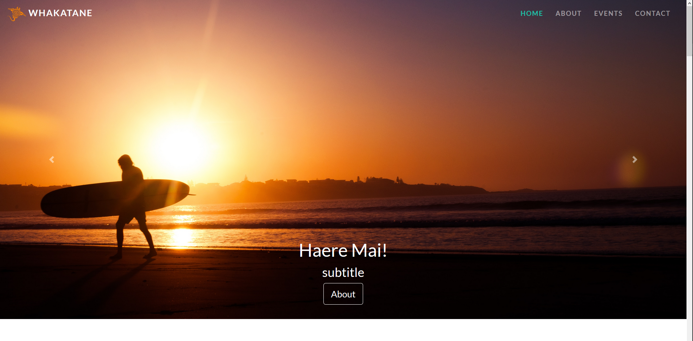
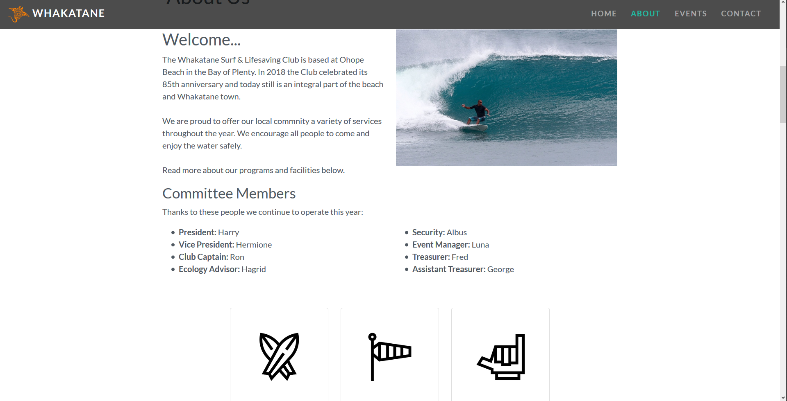
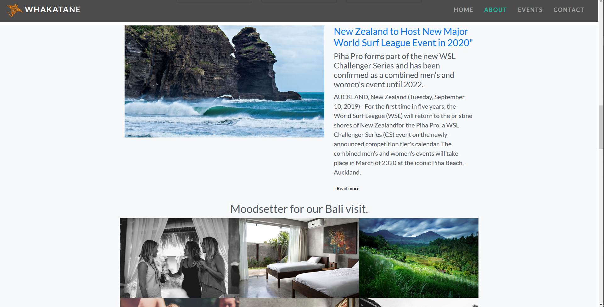
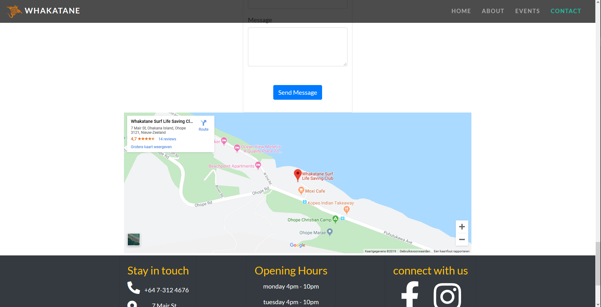

# Group Project 1 - Business Website
## Whakatane Surf School

This project was created by Geert Uyttendaele, Rico De Bondt, Jasper Springael & Erin Joosen.

It was made for educational purposes and was the consolidation of 1 month of CSS, HTML and Git learning @BeCode. 

It is shared on Github for ease of sharing with coaches and colleagues. 

---

## Preview

The page is divided into 4 sections:
- Main
- About
- News/Events
- Contact

You can find a deployed version of the website here: https://g33rt82.github.io/whakatane/

---
## Project Brief

We were to make a client ready business page in groups of 4. We chose to create a page for a surf club in New Zealand (we have no affiliation with this surf club). 

We had an extensive list of requirements and feel we've meet them all. 

---

### This project is licensed under the terms of the MIT license. 
